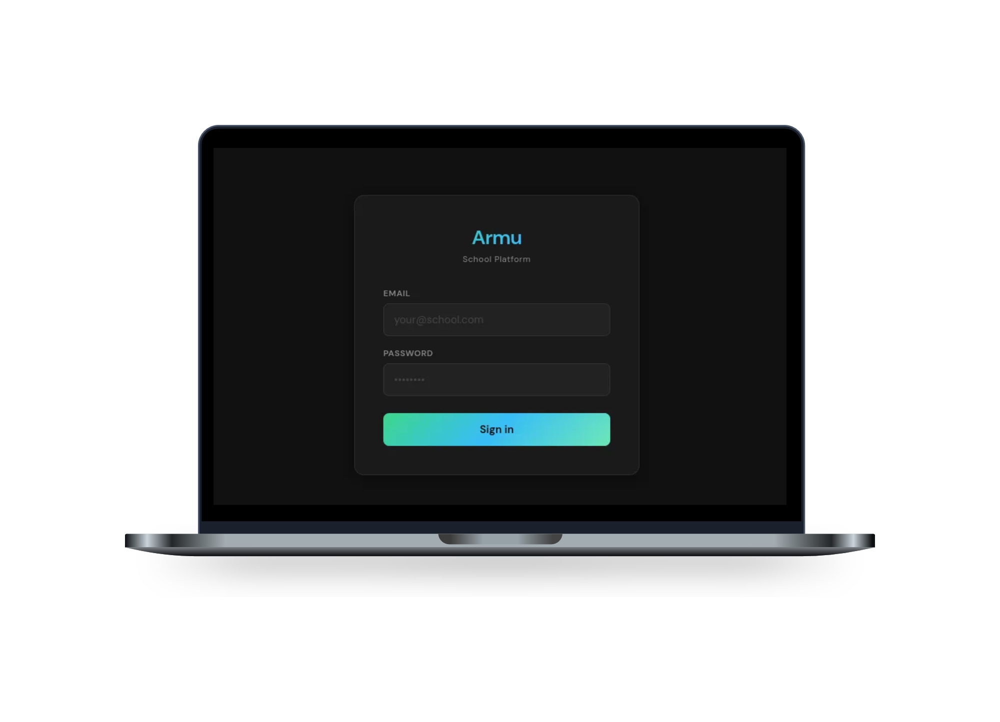
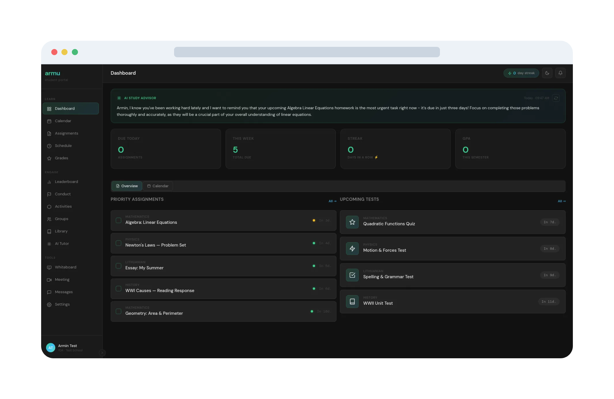
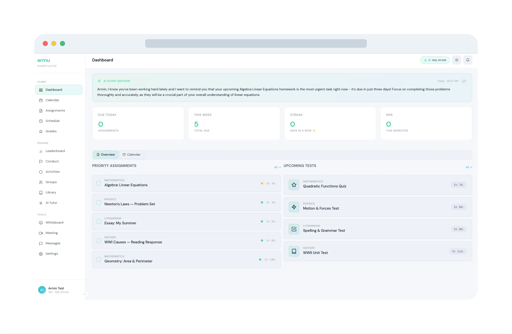

# Armu · v0.6

<p align="center">
  
</p>

A free, open source, self-hosted school platform. Replaces fragmented school software (diary systems, Google Classroom, messaging, grades, library) with a single unified platform that schools own and run themselves.

Licensed under **AGPL-3.0** — free to use, modify, and self-host. Distributions and hosted services must release source code.

---

## Features

### Students
- **Dashboard** — AI-generated daily study digest, assignment stats, upcoming tests, quick links
- **AI Tutor** — Socratic-style chat (never gives answers directly); personal and group sessions; streaming responses; file/image attachments; markdown + KaTeX math rendering; auto-generated session titles; proactive study nudges
- **Homework & Tests** — assignment list with priority/due-date tracking, completion toggles, test countdown timers
- **Schedule** — weekly timetable view
- **Grades** — grade history with colour-coded scores (≥70 green · ≥50 yellow · <50 red)
- **Calendar** — month/week view with homework, tests, grades, activities and personal events
- **Leaderboard** — class ranking by grade average
- **Groups** — study groups with shared AI chat sessions
- **Whiteboard** — real-time collaborative canvas (draw, shapes, text, eraser)
- **Messages** — direct messaging between users; AI-powered silent moderation flags harmful content for admin review
- **Activities** — extracurricular activity log
- **Library** — browse and check out books
- **Notifications** — real-time bell widget with deadline reminders and weekly AI digest

### Teachers
- **Dashboard** — AI class insights card, action chips, subject grid
- **Classes** — split-panel class list → student roster with grade averages; conduct event logging
- **Assignments** — create/edit/delete assignments; grade sheet (0–100, saves on blur); CSV export; grading progress bar
- **Schedule** — class timetable management

### Admins
- **Users** — create, edit, delete users; role and class assignment
- **School** — class and subject management; teacher assignments
- **Settings** — AI provider (Ollama / OpenAI / Anthropic / compatible); model config; temperature and top-p sliders; custom system prompt; Ollama model install with live progress; custom school logo with one-click reset; full accent colour theme (primary, secondary, tertiary) with live preview; message scanning toggle
- **Flagged Messages** — dedicated review panel for AI-flagged messages; severity bar; dismiss or action each flag; live count badge on the sidebar nav item; banner when scanning is disabled
- **Performance** — CPU/RAM/disk gauges + 60-second history graphs + running Ollama models

### Meetings (all roles)
- WebRTC video calls with mic, camera, and screen share controls
- In-call **whiteboard panel** — whiteboard icon opens the full collaborative whiteboard on the left side (tab bar design, easy to extend with more tabs); video grid hides while whiteboard is open
- **Participants toggle** — hide/show the participants sidebar mid-call
- Keyboard shortcuts: `M` mute · `C` camera · `Esc` leave

---

## Stack

| Layer | Technology |
|---|---|
| Backend | Python · Flask · Flask-SocketIO · Flask-Migrate · SQLAlchemy |
| Database | SQLite (small deployments) / PostgreSQL (larger) |
| AI | Pluggable — Ollama (local, no API costs), OpenAI, Anthropic, or any OpenAI-compatible endpoint |
| Frontend | Vanilla JS SPA (no framework) · single-shell router · partial HTML pages |
| Real-time | WebSockets via Flask-SocketIO (chat, whiteboard, meetings, notifications) |
| Scheduling | APScheduler (deadline reminders, weekly digests) |

---

## Screenshots

<p align="center">
  
  <br/><em>Dark mode</em>
</p>

<p align="center">
  
  <br/><em>Light mode</em>
</p>

---

## Minimum server specs

### Without local AI (using OpenAI / Anthropic API)

| Component | Minimum | Recommended |
|---|---|---|
| CPU | 1 core | 2+ cores |
| RAM | 512 MB | 1 GB |
| Storage | 1 GB | 5 GB |
| OS | Linux, Windows 10+, macOS 12+ | Ubuntu 22.04 LTS |
| Network | LAN or internet | — |

### With Ollama (local AI, no API costs)

| Model | RAM required | Storage for model |
|---|---|---|
| `llama3.2:3b` (tracker / digest) | 4 GB | ~2 GB |
| `gemma3:12b` (tutor / advanced) | 10 GB | ~8 GB |
| Both models together | 10 GB | ~10 GB |

> A GPU is not required but will significantly speed up responses. A CPU-only server with 10 GB RAM can run both models, but generation will be slower (~5–15 tokens/sec on a modern quad-core).

---

## Getting started

### Local / development

```bash
git clone https://github.com/Armoji-code/armu-edu
cd armu-edu
bash setup.sh
cd backend && python app.py
```

The app starts at **http://localhost:5000**.

`setup.sh` installs dependencies, generates a secret key, walks you through AI provider selection, initialises the database, creates your admin account, and optionally creates demo accounts. For a production server with a domain, use `deploy.sh` instead (see below).

### Production server (with your own domain)

Supports **Ubuntu/Debian** (apt) and **Arch/CachyOS** (pacman) — the script detects which one automatically.

```bash
git clone https://github.com/Armoji-code/armu-edu
cd armu-edu
sudo bash deploy.sh
```

It will ask for your domain name, email, and a few config questions, then automatically:

1. Runs `setup.sh` (app config, admin account) if not done yet
2. Installs **nginx** and **certbot**
3. Configures nginx as a reverse proxy (including WebSocket support)
4. Obtains a free **Let's Encrypt HTTPS** certificate for your domain
5. Creates a **systemd service** so Armu starts on boot and restarts on crash

**Before running — checklist:**

- Point your domain's DNS **A record** to your server's public IP
- If running on a **home PC behind a router**, forward ports **80** and **443** to your PC's local IP in your router's port forwarding / virtual servers settings
- If you have **UFW** enabled, open the ports: `sudo ufw allow 80/tcp && sudo ufw allow 443/tcp`
- Make sure your server's public IP matches what `nslookup yourdomain.com` returns before running

> **SSL certificate tip:** if certbot HTTP validation fails (e.g. behind a strict ISP), the script falls back gracefully. You can also get the cert manually with DNS validation:
> ```bash
> sudo certbot certonly --manual --preferred-challenges dns -d yourdomain.com --agree-tos -m you@email.com
> ```
> Add the TXT record it shows in your DNS panel, wait 30 seconds, press Enter. Then re-run `deploy.sh`.

After deployment, Armu is live at `https://yourdomain.com`. Manage the service with:

```bash
journalctl -u armu -f     # live logs
systemctl restart armu    # restart
systemctl stop armu       # stop
```

Future updates can be applied from **Admin → Settings → Software Update** — no SSH needed.

### Manual setup

```bash
# 1. Create venv and install dependencies
python3 -m venv .venv
source .venv/bin/activate
pip install -r requirements.txt

# 2. Configure
cp .env.example backend/.env
# Edit backend/.env — at minimum set SECRET_KEY:
python -c "import secrets; print(secrets.token_hex(32))"

# 3. Initialise the database
cd backend && flask --app app db upgrade

# 5. Run
python app.py
```

---

## AI setup

By default Armu uses **Ollama** for local inference (no API costs, runs on your server).

```bash
# Install Ollama: https://ollama.com
ollama pull gemma3:12b      # tutor + advanced model
ollama pull llama3.2:3b     # tracker model (digests, nudges, auto-title)
```

To switch to OpenAI or Anthropic, go to **Admin → Settings → AI Configuration** after logging in — no restart required. All AI settings are stored per-school in the database and take effect immediately.

---

## Project structure

```
armu-edu/
├── backend/
│   ├── ai/             Multi-provider AI abstraction (Ollama / OpenAI / Anthropic)
│   ├── api/            REST API blueprints (auth, teacher, admin, ai, meetings, …)
│   ├── models/         SQLAlchemy models
│   ├── static/         notif.js — real-time notification bell widget
│   ├── scheduler.py    APScheduler jobs (deadline reminders, weekly digest)
│   └── app.py          Entry point
├── frontend/
│   └── src/
│       ├── pages/      app.html (SPA shell), login.html, profile.html
│       └── partials/   One HTML file per route, injected by the client router
├── docs/               Project documentation
├── .env.example        Environment variable template
├── requirements.txt
└── LICENSE
```

---

## Environment variables

Copy `.env.example` to `backend/.env`. Key variables:

| Variable | Default | Description |
|---|---|---|
| `SECRET_KEY` | *(insecure default)* | **Required** — set a random secret before deploying |
| `DATABASE_URL` | SQLite at repo root | PostgreSQL URL for production |
| `FLASK_DEBUG` | `0` | Set to `1` for local development only |
| `CORS_ORIGINS` | `http://localhost:5000` | Allowed CORS / WebSocket origins |
| `AI_PROVIDER` | `ollama` | `ollama` \| `openai` \| `anthropic` |
| `OLLAMA_BASE_URL` | `http://localhost:11434` | Ollama server URL |

All AI settings can also be changed at runtime via Admin → Settings.

---

## Security

### Data at rest

The SQLite database is **not encrypted by default**. Anyone who obtains the file can read its contents. Passwords are bcrypt-hashed, but everything else (names, emails, grades, messages) is plaintext.

The simplest protection for a self-hosted deployment is **full-disk encryption** on the server machine — the OS encrypts everything on the drive, so a stolen disk or file is unreadable without the login credentials.

| OS | Built-in tool | Guide |
|---|---|---|
| Linux | LUKS (via `cryptsetup`) | [Arch Wiki — dm-crypt](https://wiki.archlinux.org/title/Dm-crypt/Encrypting_an_entire_system) |
| Windows | BitLocker | [Microsoft Docs — BitLocker](https://support.microsoft.com/en-us/windows/turn-on-device-encryption-0c7b0e5c-9b8e-d5dc-f9ef-1aa6e1f4) |
| macOS | FileVault | [Apple Support — FileVault](https://support.apple.com/en-us/102665) |

For additional protection, also:
- Restrict the database file to the server user: `chmod 600 armu.db`
- Keep the server on a LAN and off the public internet
- Back up the database to an encrypted location

---

## Changelog

### v0.6
- **AI message moderation** — admins can enable a silent background scan on all messages (personal and group); a local `llama3.2:3b` model classifies each message and flags anything with severity ≥ 0.5 without alerting the sender
- **Flagged Messages panel** — new dedicated admin tab (Admin → Flagged) with a full review UI: severity bar, AI reason, sender → recipient, Dismiss / Action buttons, and Pending / Dismissed / Actioned filter tabs
- **Sidebar count badge** — the Flagged nav item shows a live badge with the number of pending flags; refreshes on every navigation
- **Infinite whiteboard** — canvas replaced with a pan/zoom infinite canvas (scroll to zoom, hand tool to pan, `H`/`Space` shortcuts); zoom capped at 4×; `0` key resets the view
- **Whiteboard selection tool** — rubber-band select any mix of strokes and images; move, resize, or delete the selection; images are individually resizable by drag
- **Whiteboard export area** — click-and-drag to define an export rectangle; exports only that region as PNG
- **Whiteboard palette** — added black and white swatches alongside the accent colours
- **Custom navigation** — admins can fully rearrange, rename, and reorder the sidebar nav for each role (student / teacher / librarian) from Admin → Navigation

### v0.5
- **Web terminal** — admins can open a full shell session directly in the browser (Admin → Terminal); PTY-based over WebSocket, xterm.js frontend with full color theme and resize support
- **In-app updates** — Admin → Settings → Software Update checks GitHub for new versions and applies them with one click (git pull + pip install + db migrate + auto-restart)
- **Logo size slider** — adjustable logo height (16–94 px) in Admin → Settings → Customize
- **Production deployment** — `deploy.sh` sets up nginx, Let's Encrypt HTTPS, and a systemd service; supports Ubuntu/Debian and Arch/CachyOS automatically
- **First-run admin account** — `setup.sh` always creates an admin account; demo accounts are now opt-in (default N)
- **Bug fix:** `seed.py` was missing `admin@test.com` despite claiming to create it
- **Bug fix:** settings save bar position (fixed layout, no gap, scrolling intact)

### v0.4
- **School branding** — admins can upload a custom school logo (shown in the sidebar); a persistent "Use Default" button resets it to the Armu logo at any time
- **Accent colour theming** — primary, secondary, and tertiary accent colours are fully configurable in Admin → Settings; colour pickers with live inline preview; all UI elements (tabs, highlights, AI overview panels, filter pills, calendar dots, borders, shadows) respond to changes via CSS variables
- **Full theme propagation** — replaced every hardcoded `rgba(61,214,140,…)` / `rgba(56,189,248,…)` value across all pages and partials with `rgba(var(--g1-rgb),…)` / `rgba(var(--g2-rgb),…)` so custom colours apply everywhere instantly
- **Settings save bar fix** — "Save Changes" bar is now `position:fixed` at the viewport bottom with no gap and no layout shift; page scrolling unaffected

### v0.3.1
- **LAN access** — server now binds to `0.0.0.0` by default; other devices on the same WiFi can reach it at the host machine's local IP
- **`/admin` and `/teacher` routes** — visiting either root path now loads the correct dashboard instead of an error page
- **Profile sign-out** — added a Sign out button to the profile page for all roles (was only available in Settings before)
- **Admin users page** — fixed infinite loading caused by a missing modal; add/edit user modal now works correctly
- **Assignment modal** — fixed "New Assignment" button doing nothing (modal HTML was missing)
- **Page layout** — removed a rogue `max-width: 680px` on `.content` that was squishing every page to 680px wide
- **Page revisit loading forever** — navigating away and back to any page no longer gets stuck; router now rewrites `const`/`let` → `var` so scripts are safely re-runnable
- **onclick handlers** — fixed all buttons across the app broken by an earlier IIFE-wrapping approach; functions are now properly exposed to the global scope
- **Teacher quick-links** — AI-generated action chips and nav links no longer use dead `/teacher/X` paths; cache busted so stale links are immediately replaced
- **`/admin` and `/teacher` sidebar links** — all internal links updated to use short paths (`/classes`, `/assignments`, `/conduct`, etc.)
- **Profile sidebar corruption** — navigating to the profile page as admin or librarian no longer overwrites the sidebar with stale hardcoded HTML
- **Security section** — README now documents database encryption status and links to OS-level disk encryption guides

### v0.3
- **In-call whiteboard** — whiteboard icon in the call topbar opens the full collaborative whiteboard in a left-side tab panel (replaces video grid while open); tab bar design makes it straightforward to add more in-call tools later
- **Participants toggle** — dedicated button in the call topbar hides/shows the participants sidebar
- **Assignment creation fixed** — the "New Assignment" modal was missing from the HTML; restored with all fields (title, description, subject, type, due date)
- **Page layout fixed** — a settings-specific CSS rule (`max-width: 680px` on `.content`) was cascading globally, squishing every page; removed
- **Page revisit fixed** — navigating away and back to a page caused infinite loading because `const`/`let` re-declarations threw `SyntaxError`; the router now rewrites them to `var` before injection so scripts are safely re-runnable
- **onclick handlers fixed** — an earlier IIFE-wrapping approach scoped all partial functions locally, breaking every button across the app; reverted in favour of the `const`→`var` approach which keeps functions in global scope

### v0.2
- Real-time collaborative whiteboard (canvas, shapes, text tool, eraser)
- WebRTC video meetings (camera, mic, screen share, multi-peer)
- Direct messaging between users
- Group study rooms with shared AI chat sessions
- Teacher assignment management and grade sheet
- Admin performance monitoring dashboard
- Notification system with real-time SocketIO delivery

### v0.1
- Initial release: student dashboard, AI tutor, homework/tests, schedule, grades, calendar, leaderboard, library, activities, conduct log
- Multi-role auth (student / teacher / admin / librarian)
- Multi-provider AI (Ollama / OpenAI / Anthropic)
- APScheduler deadline reminders and weekly AI digest
